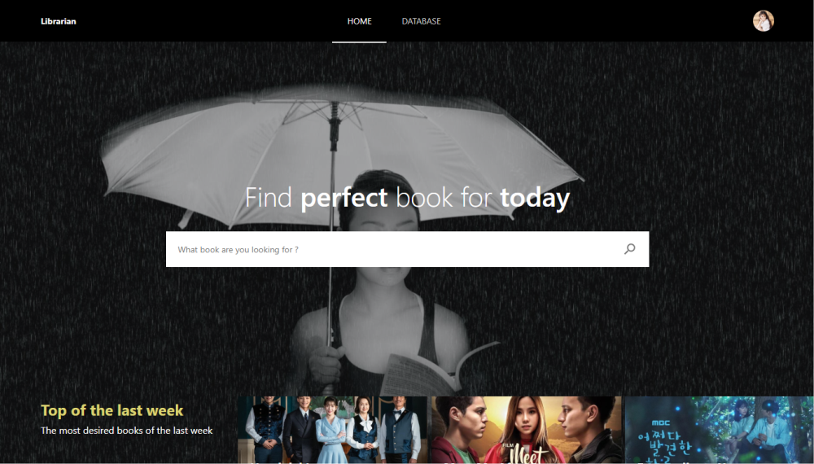
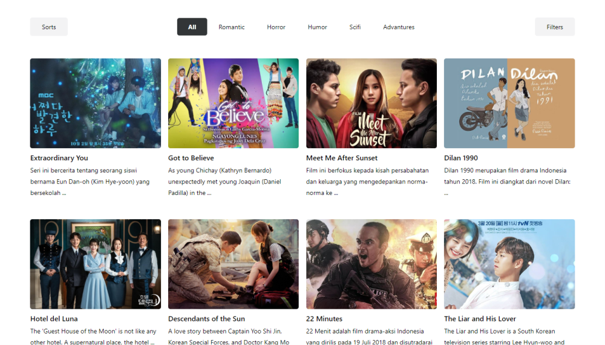
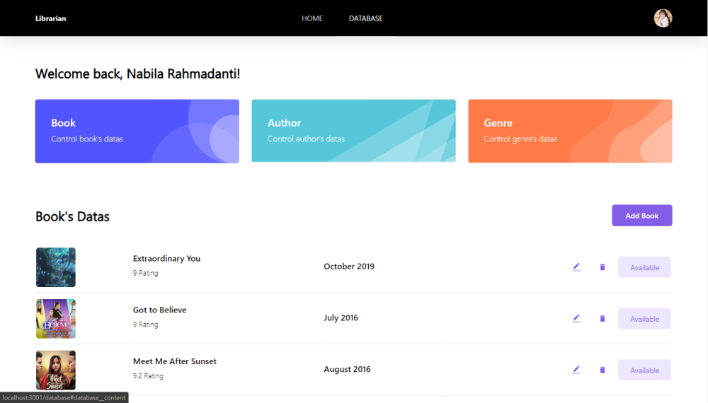

<p align="center">
  <a href="https://github.com/othneildrew/Best-README-Template">
    
  </a>

  <h3 align="center">Librarian Apps</h3>

  <p align="center">
    Librarian is a modern web app that allows librrarian to do transaction like borrow and insert or delete book from collection.
    <br />
    <a href="https://librarian-apps.web.app"><strong>Show Demo »</strong></a>
  </p>
</p>

## Table of Contents

* [About the Project](#about-the-project)
  * [Built With](#built-with)
* [Getting Started](#getting-started)
  * [Prerequisites](#prerequisites)
  * [Installation](#installation)
* [Usage](#usage)
* [Demo](#demo)

## About the Project
### Built With
* [React JS](https://reactjs.org)

## Getting Started
This is an example of how you may give instructions on setting up your project locally. To get a local copy up and running follow these simple example steps.
To try the apps, you must follow the simple example steps below.

### Prerequisites
* [npm](https://www.npmjs.com)

### Installation

To install Librarian, follow these steps:

npm:
```
npm install
```

yarn:
```
yarn install
```
## Usage

To use Library App, follow these steps:

1. serve backend server, we provided backend server on http://app-1f820b94-8f0a-4899-9184-460036f902de.cleverapps.io/
2. run app on your device `npm start`

## Demo
<p align="center"></p>
<p align="center"></p>
<p align="center"></p>
<p align="center"></p>
