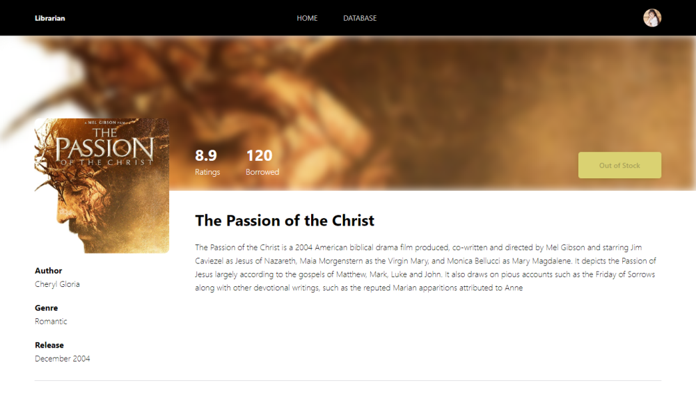

<p align="center">
  <a href="https://github.com/othneildrew/Best-README-Template">
    
  </a>

  <h3 align="center">Librarian Apps</h3>

  <p align="center">
    Librarian is a modern web app that allows librrarian to do transaction like borrow and insert or delete book from collection.
    <br />
    <a href="https://librarian-apps.web.app"><strong>Show Demo »</strong></a>
  </p>
</p>

## Table of Contents

* [About the Project](#about-the-project)
  * [Built With](#built-with)
* [Getting Started](#getting-started)
  * [Prerequisites](#prerequisites)
  * [Installation](#installation)
* [Usage](#usage)
* [Demo](#demo)
* [License](#license)

## About the Project
### Built With
* [React JS](https://reactjs.org)

## Getting Started
This is an example of how you may give instructions on setting up your project locally. To get a local copy up and running follow these simple example steps.
To try the apps, you must follow the simple example steps below.

### Prerequisites
* [npm](https://www.npmjs.com)

### Installation

1. Clone the repo
```sh
git clone https://github.com/dicky-julian/library-apps.git
```
2. Install NPM packages
```sh
npm install
```
3. If you use your local as backend server, Enter your endpoint in `service.js`
```JS
const baseUrl = {{ Your endpoint }};
```
for backend, you can see https://github.com/dicky-julian/library-api

## Usage

To use Library App, follow these steps:

1. serve backend server, we provided backend server on http://app-1f820b94-8f0a-4899-9184-460036f902de.cleverapps.io/
2. run app on your device `npm start`

## Demo
<p align="center"></p>
<p align="center"></p>
<p align="center"></p>
<p align="center"></p>

## License
MIT License

Copyright (c) [2022] [Dicky Julian Pratama]

Permission is hereby granted, free of charge, to any person obtaining a copy
of this software and associated documentation files (the "Software"), to deal
in the Software without restriction, including without limitation the rights
to use, copy, modify, merge, publish, distribute, sublicense, and/or sell
copies of the Software, and to permit persons to whom the Software is
furnished to do so, subject to the following conditions:

The above copyright notice and this permission notice shall be included in all
copies or substantial portions of the Software.

THE SOFTWARE IS PROVIDED "AS IS", WITHOUT WARRANTY OF ANY KIND, EXPRESS OR
IMPLIED, INCLUDING BUT NOT LIMITED TO THE WARRANTIES OF MERCHANTABILITY,
FITNESS FOR A PARTICULAR PURPOSE AND NONINFRINGEMENT. IN NO EVENT SHALL THE
AUTHORS OR COPYRIGHT HOLDERS BE LIABLE FOR ANY CLAIM, DAMAGES OR OTHER
LIABILITY, WHETHER IN AN ACTION OF CONTRACT, TORT OR OTHERWISE, ARISING FROM,
OUT OF OR IN CONNECTION WITH THE SOFTWARE OR THE USE OR OTHER DEALINGS IN THE
SOFTWARE.
